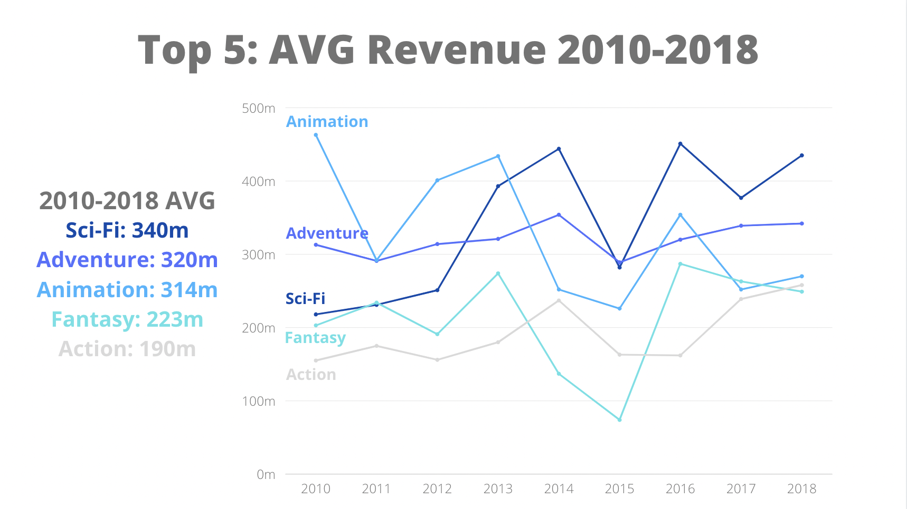
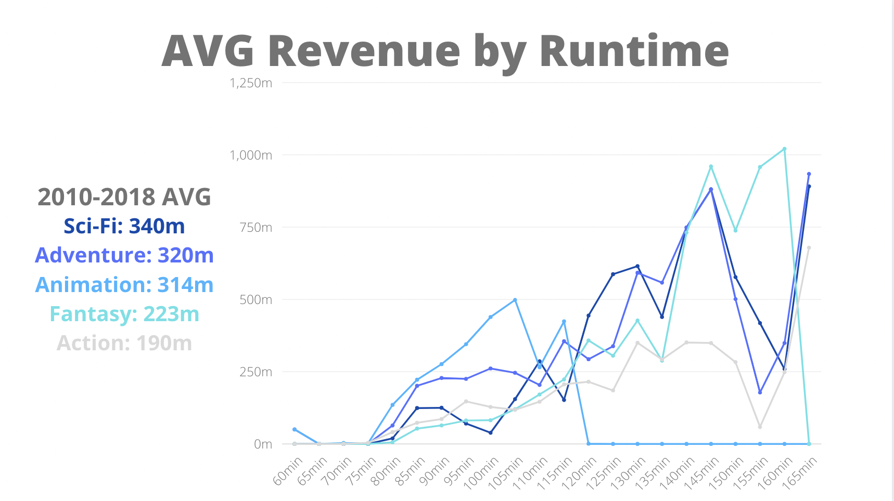
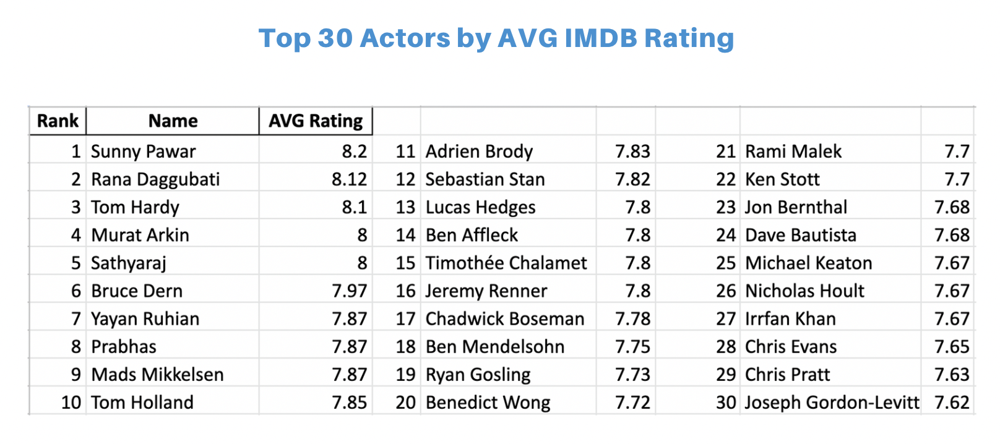

# Movie Analysis

**Author**: Dan Lee

## Overview

This presentation contains data-driven results and recommendations for Microsoft as they consider their entry into the film industry. Given this company's extensive resources, Microsoft has the ability to make a big splash and enter the field at the top. They can make high caliber movies that yield revenue and ratings competitive with the upper-echelon in the industry standard.

As a start, this presentation will recommend that executives aim to make movies of a certain genre, time length, and with specific personnel.

## Business Problem

Microsoft is one of the big players in personal computers, software/operating systems, video games, and accessories. Now they want in on the $100+ billion film industry. In this presentation we will give Microsoft executives some vision and direction in how to enter the movie industry at the top.

We will focus on three questions:
1. What movie genres earn the most worldwide revenue?
2. How long should a movie be to maximize revenue?
3. What movie personnel will maximize IMDb ratings?

## Data

The data used in this presentation comes from two sources:
1. IMDb (Internet Movie Database): will provide information on genres, personnel, runtime length, and ratings
2. BOM (Box Office Mojo): will provide revenue data

## Methods

The data was prepared by appropriately handling duplicate and null values. A total of five datasets were prepared and merged. Some data was organized to be less granular (runtime windows, revenue/rating averages) to make interpretation of results easier. Additionally, choices were made to exclude lesser known films to aid Microsoft in targeting audiences with the most financial benefit.

## Results

Here is a summary of key findings from this study:
* There are 5 genre categories that make noticeably more revenue than the rest: Sci-Fi, Adventure, Animation, Fantasy, and Action
* There are ~30 minute windows of runtime in the top 5 genres that can be considered revenue "sweet-spots"
* As movie time length increases, generally so does revenue
* Movie personnel (e.g. cast, directors, composers) have been identified in their association with the highest user-rated films on IMDb

### Visual 1


### Visual 2


### Visual 3


## Conclusions

To summarize:
1. Make movies in the following genres: Sci-Fi, Adventure, Animation, Fantasy, and Action. To make the most revenue, focus on Sci-Fi and Adventure.
2. Make movies in the recommended ~30 minute windows to maximuze revenue. Make longer movies.
3. Hire personnel associated with the top ratings as voted on by users of IMDb.

Good luck and godspeed!

## Repository Structure

```
├── README.md     
<- The top-level README for reviewers of this project
├── Analysis.ipynb   
<- Narrative documentation of analysis in Jupyter notebook
├── Analysis_Notebook.pdf
<- PDF version of Jupyter notebook
├── Movie Analysis Presentation.pdf.pdf         
<- PDF version of project presentation
├── zippedData                                
<- Both sourced externally and generated from code
└── images                              
<- Both sourced externally and generated from code
```
≈